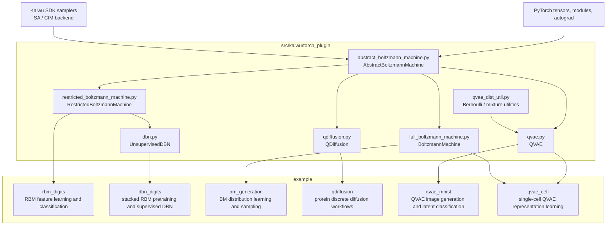

 

# Kaiwu-PyTorch-Plugin

**语言版本**: [中文](README_ZH.md) | [English](README.md)

有关 Kaiwu-PyTorch-Plugin 的使用说明，请参考[**项目文档**](https://kaiwu-pytorch-plugin-docs.readthedocs.io/zh-cn/latest/)。

## 项目概览

`Kaiwu-PyTorch-Plugin` 是一个基于 PyTorch 和 Kaiwu SDK 的量子计算编程套件。它支持在相干光量子计算平台上训练和评估 Restricted Boltzmann Machine（RBM）与 Boltzmann Machine（BM）。插件提供了易于使用的接口，便于研究人员和开发者快速实现能量模型的训练、验证与应用。

Restricted Boltzmann Machine 是一种基于能量函数的无监督学习模型，由可见层和隐藏层组成，层间全连接、层内无连接。它通过建模数据分布来学习输入的隐含特征，常用于特征提取、降维和协同过滤，也是更复杂模型的基础。Boltzmann Machine 则是全连接的随机神经网络，可见层与隐藏层内部也允许连接；其传统采样成本较高，而量子计算为这一类模型提供了新的求解路径。



上图展示了项目的主要代码结构：

- `kaiwu-torch-plugin` 部分包含抽象基类、RBM、BM、QVAE、Q-Diffusion 和 DBN 等核心模块
- `example` 部分包含若干示例，包括数字识别、图像生成、蛋白质序列生成和单细胞表征学习
- `tests` 部分包含对应的基础测试

### 主要特性

- 量子支持：继承 Kaiwu SDK 能力，支持调用光量子计算后端
- 原生 PyTorch 支持：无缝集成 PyTorch 生态，支持 GPU 加速
- 灵活架构：支持自定义可见层和隐藏层维度
- 可扩展性：模块化设计便于扩展新的能量函数和采样方法
- Q-Diffusion 支持：提供公开的 `QDiffusion` 模块，用于基于 DPLM backbone 的能量引导离散生成

### 插件优势

- 灵活配置：采样方法和能量函数解耦实现，便于扩展新的模型和求解方式；BM 和 RBM 也可以通过自定义 objective 集成进其他模型
- 示例参考：项目提供了 digits、QVAE 等完整示例，可作为二次开发参考
- 前沿算法支持：插件为量子启发式生成模型和生命科学应用提供了稳定的实现基础。例如，项目支持将 Boltzmann 分布引入 VAE，并支持高噪声、大规模单细胞数据上的端到端训练与分析

## 快速开始

### 环境要求

- python == 3.10
- kaiwu == 1.3.1
- torch == 2.7.0
- numpy == 2.2.6

### 代码风格

- 遵循 PEP 8 规范

### 安装步骤

1. **创建并激活环境**

   ```bash
   # 推荐使用 conda 创建新环境
   conda create -n quantum_env python=3.10
   conda activate quantum_env
   ```

2. **克隆仓库**

   ```bash
   git clone https://github.com/QBoson/Kaiwu-pytorch-plugin.git
   cd kaiwu-pytorch-plugin
   ```

3. **安装依赖**

   ```bash
   pip install -r requirements/requirements.txt
   ```

   Kaiwu SDK 需要单独安装，见下方说明。

4. **安装插件**

   ```bash
   pip install .
   ```

### Kaiwu SDK 安装说明（必需）

现在kaiwu版本1.3.1可以直接通过`pip install kaiwu==1.3.1`来安装

其他版本的Kaiwu SDK 的下载和安装步骤如下：


1. **获取 SDK**

- 访问 [Kaiwu SDK 下载页面](https://platform.qboson.com/sdkDownload)（需注册）
- 参考 [Kaiwu SDK 安装说明](https://kaiwu-sdk-docs.qboson.com/zh/latest/source/getting_started/sdk_installation_instructions.html)

2. **配置授权信息**

获取你的 SDK 授权信息：

```text
User ID: <your-user-id>
SDK Token: <your-sdk-token>
```

> 请将上述内容替换为你的实际授权信息

### 获取真机调用资格

如果希望体验真实量子计算，请先在 [QBoson Platform](https://platform.qboson.com/) 注册账户，并根据文档中的联系方式联系官方人员申请真机配额。

## 示例案例

### 简单示例

下面给出一个简单的 RBM 调用示例，主要展示基础接口的使用方式，不涉及具体任务。

```python
import torch
from torch.optim import SGD
from kaiwu.torch_plugin import RestrictedBoltzmannMachine
from kaiwu.classical import SimulatedAnnealingOptimizer
from kaiwu.cim import CIMOptimizer, PrecisionReducer

if __name__ == "__main__":
    SAMPLE_SIZE = 17
    USE_CIM = False

    if USE_CIM:
        sampler = CIMOptimizer(task_name="test_kpp", wait=True)
        sampler = PrecisionReducer(
            sampler,
            precision=8,
            truncated_precision=10,
            target_bits=550,
            only_feasible_solution=False
        )
    else:
        sampler = SimulatedAnnealingOptimizer()
    num_nodes = 50
    num_visible = 20
    x = 1 - 2.0 * torch.randint(0, 2, (SAMPLE_SIZE, num_visible))

    # Instantiate the model
    rbm = RestrictedBoltzmannMachine(
        num_visible,
        num_nodes - num_visible,
    )
    # Instantiate the optimizer
    opt_rbm = SGD(rbm.parameters())

    # Example of one iteration in a training loop
    # Generate a sample set from the model
    x = rbm.get_hidden(x)
    s = rbm.sample(sampler)

    opt_rbm.zero_grad()
    # Compute the objective---this objective yields the same gradient as the negative
    # log likelihood of the model
    objective = rbm.objective(x, s)
    # Backpropgate gradients
    objective.backward()
    # Update model weights with a step of stochastic gradient descent
    opt_rbm.step()
    print(objective)
```

### Q-Diffusion 快速开始

Q-Diffusion 作为通用离散序列生成核心，已经可以从顶层插件包直接导入：

```python
from kaiwu.torch_plugin import QDiffusion, QDiffusionConfig
from kaiwu.torch_plugin.qdiffusion import SequenceTokenSpec

# Build your own proposal model, energy model, token spec, and energy adapter.
model = QDiffusion(
    proposal_model=proposal_model,
    energy_model=energy_model,
    token_spec=SequenceTokenSpec(
        pad_id=0,
        bos_id=1,
        eos_id=2,
        mask_id=3,
    ),
    energy_adapter=energy_adapter,
    config=QDiffusionConfig(num_candidates=4),
)
```

可直接运行的 DPLM 示例位于 `example/qdiffusion/`，其中：

- `simple/`：最小训练和生成示例
- `dplm/`：基于 DPLM 的蛋白案例完整工作流与适配代码

如果你要运行这些 DPLM 示例，请额外安装示例依赖：

```bash
pip install -r example/qdiffusion/requirements.txt
```

### 分类任务：手写数字识别

该示例展示如何使用 Restricted Boltzmann Machine（RBM）在 Digits 数据集上进行特征学习和分类，适合初学者理解 RBM 在图像特征提取与分类任务中的基本流程。主要内容包括：

- **数据增强与预处理**：对原始 8x8 手写数字图像进行上下左右平移扩充，并使用 MinMaxScaler 做归一化
- **RBM 模型训练**：实现 `RBMRunner`，封装 RBM 的训练过程，并支持样本与权重可视化
- **特征提取与分类**：使用 RBM 隐层输出作为特征，结合逻辑回归进行分类评估
- **可视化分析**：支持在训练过程中查看生成样本和权重矩阵，辅助观察学习效果

运行方式：`example/rbm_digits/rbm_digits.ipynb`

---

### 生成任务：基于 Q-VAE 的 MNIST 图像生成

该示例展示如何在 MNIST 手写数字数据集上训练和评估 Quantum Variational Autoencoder（Q-VAE），适合希望理解 Q-VAE 训练、生成与评估流程的用户。主要内容包括：

- **数据加载与预处理**：实现带 batch 索引的数据集封装，并完成 ToTensor 和 flatten 处理
- **模型结构**：构建包含 encoder、decoder 和 RBM latent prior 的 Q-VAE
- **训练过程**：实现完整训练循环，跟踪 loss、ELBO、KL divergence 等指标，并支持 checkpoint 保存
- **可视化与生成**：对原图、重建图和生成图进行可视化对比，便于直观评估模型效果

运行方式：`example/qvae_mnist/train_qvae.ipynb`


---

### Q-Diffusion 生成任务：Proteomes: Homo sapiens Generation

该示例展示如何使用 `Q-Diffusion` 配合 DPLM backbone，完成蛋白质序列生成中的能量引导离散扩散训练与评估。它适合希望理解通用 `Q-Diffusion` 核心如何连接到实际蛋白质生成实验的用户，可作为训练、引导生成、checkpoint rerun 和评估分析的参考工作流。主要内容包括：

- **DPLM 模型组装**：通过 `example/qdiffusion/dplm/utils/dplm_builder.py` 加载 proposal backbone 和 energy backbone，整理 token metadata，构建 energy adapter，并最终组装出一个通用 Q-Diffusion 实例
- **训练目标**：在 epoch 循环中将 FASTA 序列 tokenize 为 `targets`，调用 `generator.objective({"targets": ...})`，把干净序列腐蚀成 noisy states，采样 proposal candidates，并优化 `energy_objective.mean()` 训练能量引导分支
- **Checkpoint 与复现实验**：保存轻量 checkpoint，包含 energy encoder、`feature_projector`、energy backend 权重、`energy_head` 和 `vocab_proj`，再据此重建 baseline 和 guided generator 用于测试时生成和复现实验
- **评估与报告**：比较 baseline 和 guided 输出在 identity、Jensen-Shannon divergence、uniqueness、repeat ratio 和 ESM2 embedding distance 等指标上的表现，并输出结构化报告

运行最小示例：

```bash
pip install -r example/qdiffusion/requirements.txt
python example/qdiffusion/simple/simple_train_example.py
python example/qdiffusion/simple/simple_generate_example.py
```

运行完整 DPLM workflow：

```bash
python example/qdiffusion/dplm/train_workflow.py
```

如果想先聚焦阅读该示例目录及其数据流，请参考 `example/qdiffusion/README_ZH.md`。

---

## 科研成果

### QBM Inside VAE = 更强的数据表征生成器（QBM-VAE）

自然领域中的数据，例如生物、化学和材料科学数据，往往极其复杂，传统的高斯 i.i.d. 假设很容易造成表示失真。

基于相干光量子计算机原生的 Boltzmann 分布采样能力，我们构建了 Quantum Boltzmann Machine（QBM）增强的 Deep Variational Autoencoder（QBM-VAE），显著提升了 VAE 的编码表达能力，使模型能够捕捉更深层的数据结构特征。

在单细胞转录组分析中，QBM-VAE 能显著提高聚类精度，并发现传统方法难以识别的新细胞亚型，为靶点发现提供新的线索。

基于这一表示，我们进一步完成了百万级单细胞转录组数据整合，并在细胞聚类、分类、轨迹推断等下游任务中取得了优于现有方法的表现，验证了该潜在表示的有效性。

如果你对这项工作感兴趣，可以参考论文：
[**Quantum-Boosted High-Fidelity Deep Learning**](https://arxiv.org/pdf/2508.11190)


---

## 致谢

- 感谢所有贡献者的宝贵投入
- 感谢量子计算社区给予的支持与反馈

## 联系方式

1. 玻色量子开发者社区，获取更多学习资源
2. 玻色量子官方助手，真机申请及合作咨询
3. 邮箱联系方式：developer@boseq.com

    
 

