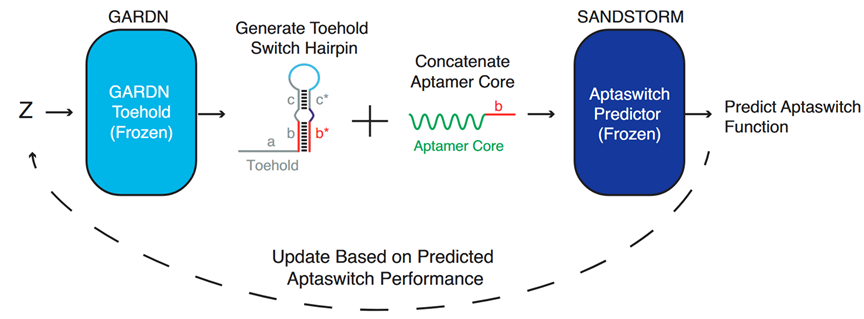
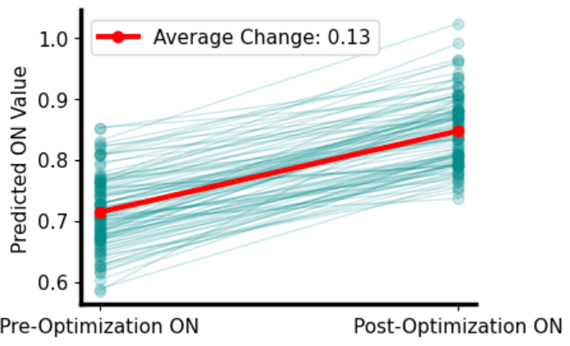
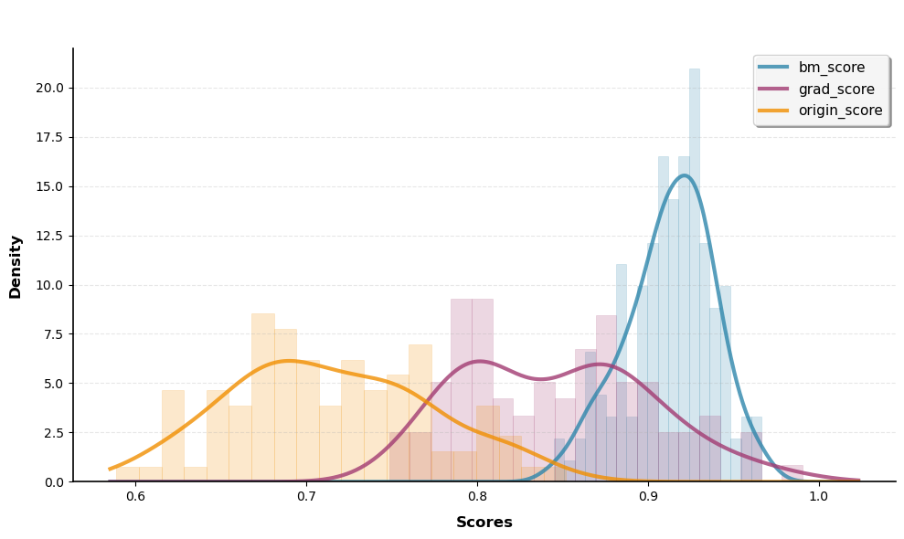

# 基于玻尔兹曼机的RNA序列生成

## 目的

在一个小样本任务上训练BM进行数据增强，预期看到生成效果相较于增强前有所提升。

本示例用于完整展示 BM 在小样本 RNA 序列数据上的训练、生成与评估流程，体现量子增强的BM能更高效地探索高维序列空间，在小样本条件下生成多样性更高的候选序列。

### 场景描述：

Aptaswitch为一类能通过高亲和力和特异性结合特定目标分子（如蛋白质、小分子、离子等）的短核酸序列。当Aptaswitch与目标分子结合时，会发生构象变化（如折叠或解折叠），从而发出荧光。

因此，遇到目标分子时，发生构象变化的Aptaswitch的比例越高意味着该Aptaswitch有更好的性能。原论文收集384条长度为137的Aptaswitch序列训练判别器，将其他任务的生成器迁移至该领域，并优化z使得生成序列的预测值提升。

性能指标：遇到目标分子时发生构象变化的 Aptaswitch 比例越高，性能越好。

如上图所示，原流程为使用下列代码实现的流程。

参考文献：https://doi.org/10.1038/s41467-025-59389-8 

代码：https://github.com/AlexGreenLab/GARDN-SANDSTORM#

上图为原模型流程，从正态分布采样出100个128维的z，经过生成器生成Aptaswitch，进入判别器进行预测，通过预测值对z不同维度的梯度优化z。
### 本实验方法

采用上述原始流程（由代码实现），但将生成器替换为BM。在小样本条件下进行数据增强，对比增强前后的判别器效果。

### 结果
原论文的结果如下图：

我们使用优化后的100个z去训练BM（将浮点数二值化为0/1），采样生成新的z，使用同样的判别器得到预测值，并且使用高预测值的表示迭代训练，预期预测值有所提升。
