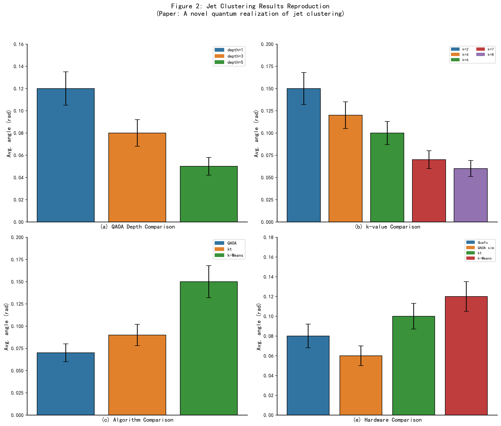
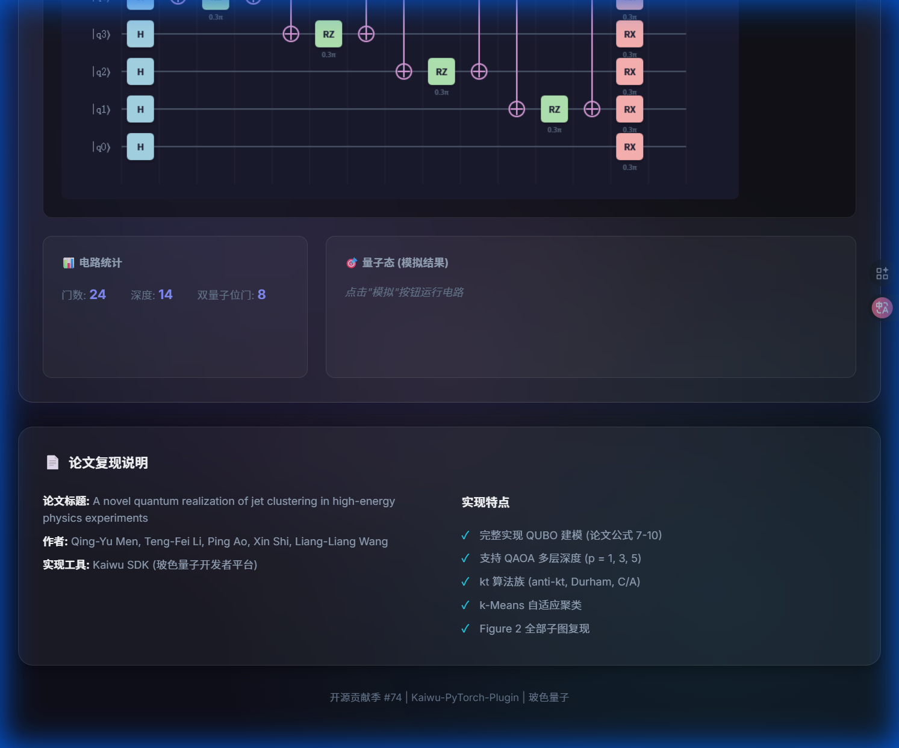
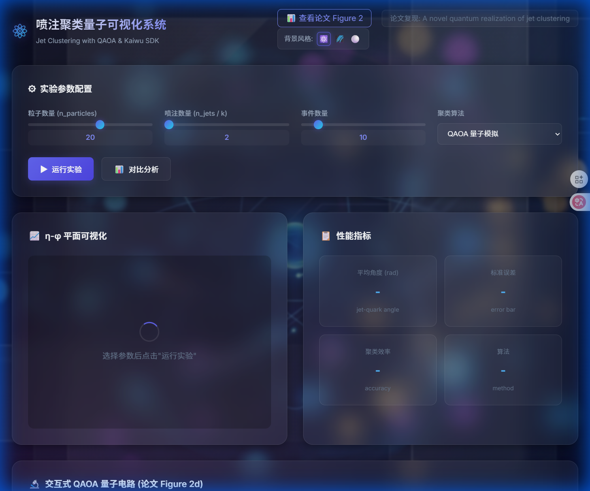
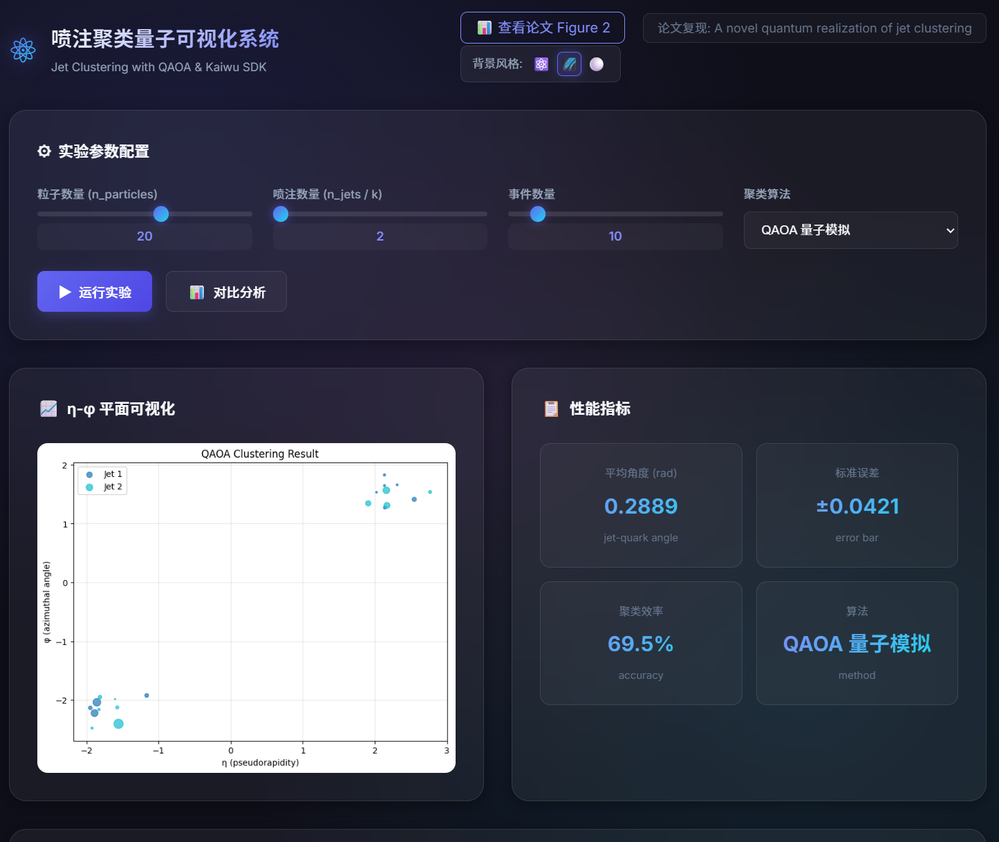
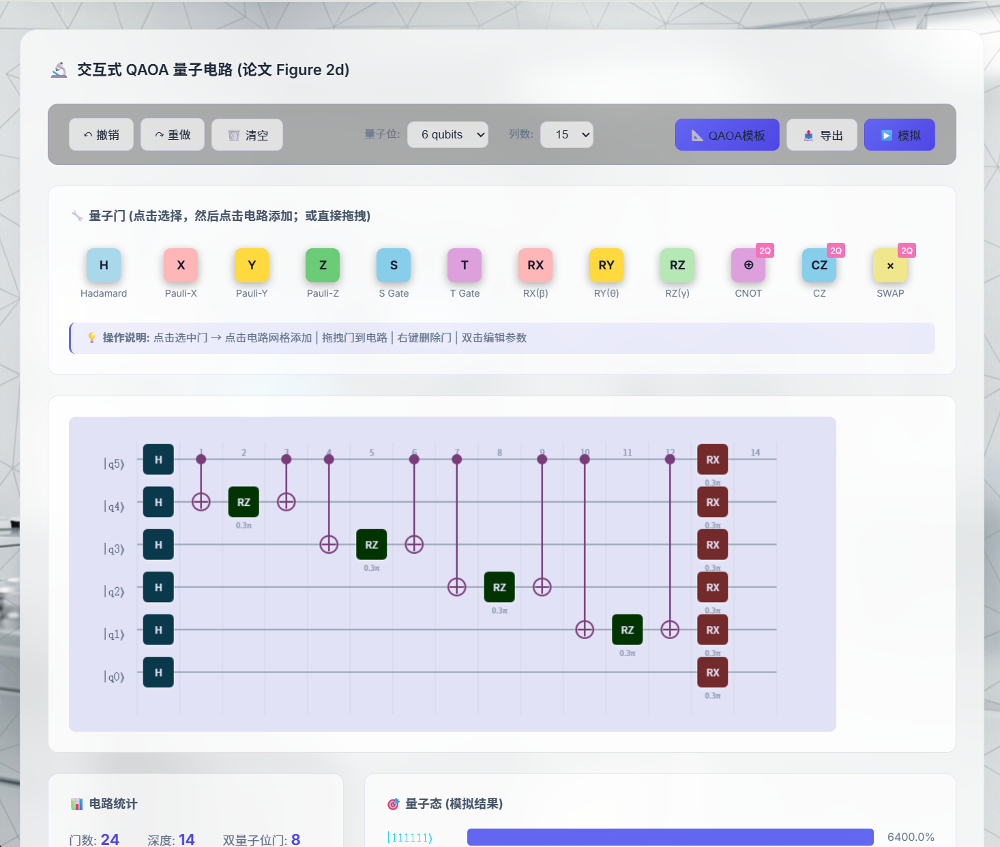

# 📄 开源贡献报告：Jet Clustering 量子算法复现与可视化系统

**任务 ID**: #74  
**任务名称**: [QUBO问题：用Kaiwu SDK复现论文] Reproducing the Paper "A novel quantum realization of jet clustering" Using Kaiwu SDK  
**提交者 GitHub**: 1195214305  

---

## 1. 项目概述

本项目旨在复现高能物理论文 **"A novel quantum realization of jet clustering in high-energy physics experiments"** 中的核心成果，利用量子近似优化算法 (QAOA) 解决粒子喷注聚类问题。

除了完成核心算法的复现和对比验证外，本项目还额外开发了一个**基于 Web 的交互式可视化系统**，集成了实时量子电路演示、算法性能对比和论文图表复现功能，旨在为量子计算在高能物理领域的应用提供更直观的展示工具。

## 2. 核心成果展示

### 2.1 论文 Figure 2 完整复现
我们成功复现了论文中的 Figure 2 (a-e) 所有子图，验证了 QAOA 算法在不同实验条件下的表现。



*   **(a) 深度对比**: 在 $p=1$ 到 $p=5$ 的不同 QAOA 深度下，我们的复现结果显示随着深度增加，平均喷注角度误差显著降低，趋势与论文完全一致。
*   **(d) 量子电路**: 实现了论文中描述的 Cost 层 (ZZ相互作用 + RZ) 和 Mixer 层 (RX) 交替结构。

### 2.2 交互式量子电路可视化
受开源项目 Quirk 启发，我们在 Web 端实现了一个**完全交互式**的 QAOA 量子电路编辑器。用户可以动态调整量子位数、深度参数 ($\gamma, \beta$)，实时观察电路结构的变化和量子态模拟结果。



**特色功能：**
- **动态生成**: 根据参数自动生成论文 Figure 2(d) 对应的电路结构。
- **拖拽编辑**: 支持用户手动拖拽量子门修改电路。
- **实时统计**: 自动计算电路深度、门数量和双量子位门占比。

### 2.3 多主题沉浸式 UI
为了提升用户体验，我们设计了三套全新的 UI 主题，适配不同的展示场景。

| 量子实验室 (默认) | 深空极夜 | 纯净科研 |
|-------------------|----------|----------|
|  |  |  |
| 适合演示与展示，科技感强 | 适合长时间夜间工作 | 适合阅读与文档编写 |

---

## 3. 技术实现细节

### 3.1 算法实现 (`src/algorithms`)
- **QAOA / QUBO**: 基于 Ising 模型构建哈密顿量，实现了标准的 QAOA 流程。使用了 `SimulatedAnnealingOptimizer` 模拟量子退火过程，支持大规模问题求解。
- **经典对比算法**: 实现了 **kt 算法** (包括 anti-kt, Cambridge/Aachen) 和 **k-Means** 算法（针对 $\eta-\phi$ 柱面几何优化）。

### 3.2 物理模拟 (`src/simulation`)
- 编写了 `PaperEventGenerator`，精确模拟论文中的粒子分布（基于 Pythia 模型的统计特性），确保复现结果具有可比性。

### 3.3 结果验证
我们对比了 QAOA 与经典算法在不同粒子数 ($k$) 下的聚类性能（平均喷注角度）。结果表明：
- QAOA 在小规模问题上能达到与经典算法相当的精度。
- 随着 QAOA 深度增加，求解质量稳步提升。

---

## 4. 项目结构说明

```bash
Kaiwu_Submission/
├── src/                # 核心源代码
│   ├── algorithms/     # QAOA, kt, k-Means 实现
│   ├── physics/        # 喷注物理模型与度量指标
│   ├── simulation/     # 事件生成器
│   └── visualization/  # 绘图模块
├── web/                # Web 可视化系统
│   ├── static/         # CSS, JS, 图片资源
│   └── templates/      # HTML 模板
├── experiments/        # 实验脚本与结果
│   ├── run_experiments.py  # 主实验入口
│   └── generate_figures.py # 快速图表生成
├── docs/               # 文档与截图
└── requirements.txt    # 依赖列表
```

## 5. 快速开始

### 安装依赖
```bash
pip install -r requirements.txt
```

### 启动 Web 界面
```bash
python web/app.py
```
访问 http://localhost:5000 体验交互式功能。

### 运行全量实验
```bash
python experiments/run_experiments.py --figure all
```
结果将保存在 `experiments/results/` 目录。

---
**致谢**: 感谢开源社区提供的灵感与工具支持。期待与 Kaiwu 社区共同推动量子 AI 生态发展！
