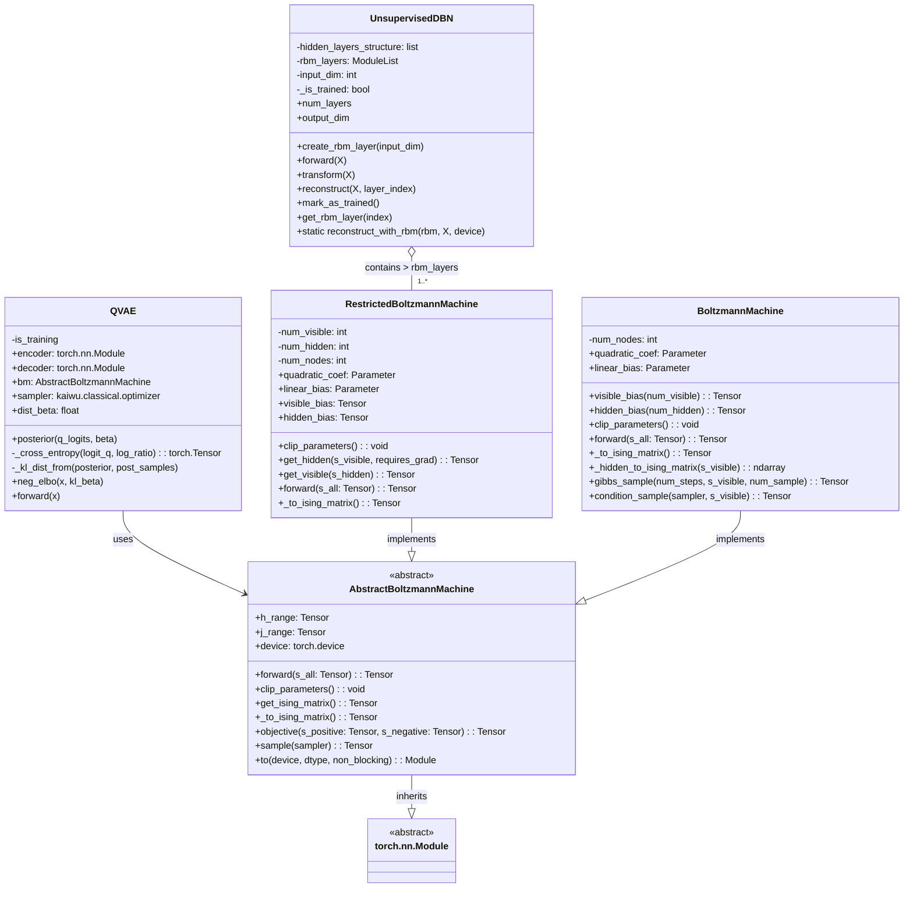
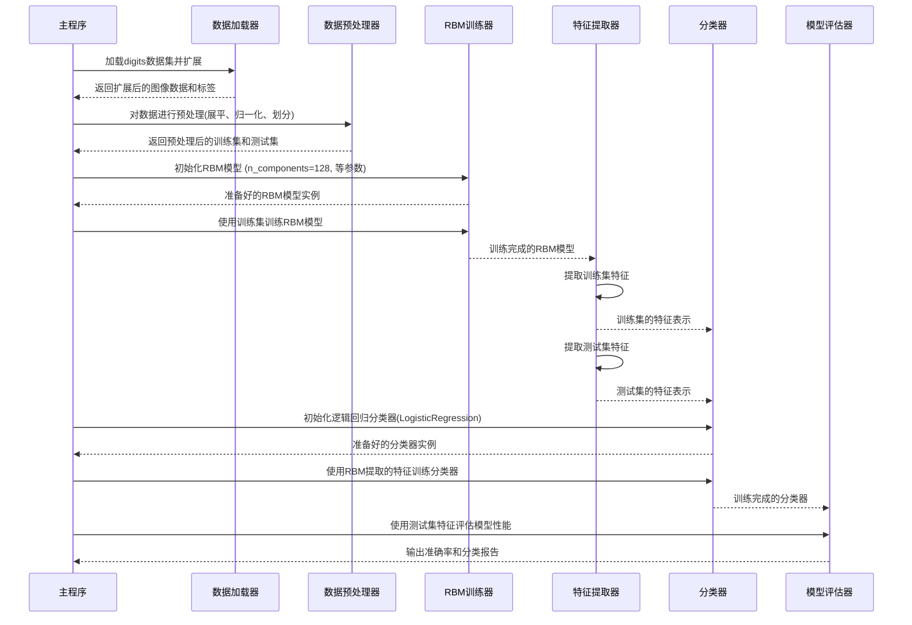
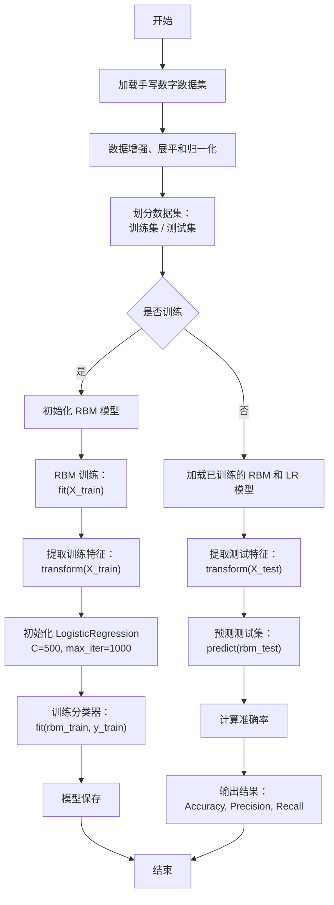

```mermaid
classDiagram
    class torch.nn.Module {
        <<abstract>>
    }

    class AbstractBoltzmannMachine {
        <<abstract>>
        +h_range: Tensor
        +j_range: Tensor
        +device: torch.device
        +forward(s_all: Tensor): Tensor
        +clip_parameters(): void
        +get_ising_matrix(): Tensor
        +_to_ising_matrix(): Tensor
        +objective(s_positive: Tensor, s_negative: Tensor): Tensor
        +sample(sampler): Tensor
        +to(device, dtype, non_blocking): Module
    }

    class RestrictedBoltzmannMachine {
        -num_visible: int
        -num_hidden: int
        -num_nodes: int
        +quadratic_coef: Parameter
        +linear_bias: Parameter
        +visible_bias: Tensor
        +hidden_bias: Tensor
        +clip_parameters(): void
        +get_hidden(s_visible, requires_grad): Tensor
        +get_visible(s_hidden): Tensor
        +forward(s_all: Tensor): Tensor
        +_to_ising_matrix(): Tensor
    }

    class BoltzmannMachine {
        -num_nodes: int
        +quadratic_coef: Parameter
        +linear_bias: Parameter
        +visible_bias(num_visible): Tensor
        +hidden_bias(num_hidden): Tensor
        +clip_parameters(): void
        +forward(s_all: Tensor): Tensor
        +_to_ising_matrix(): Tensor
        +_hidden_to_ising_matrix(s_visible): ndarray
        +gibbs_sample(num_steps, s_visible, num_sample): Tensor
        +condition_sample(sampler, s_visible): Tensor
    }

    class QVAE {
        -is_training
        +encoder: torch.nn.Module
        +decoder: torch.nn.Module
        +bm: AbstractBoltzmannMachine
        +sampler: kaiwu.classical.optimizer
        +dist_beta: float
        +posterior(q_logits, beta)
        -_cross_entropy(logit_q, log_ratio): torch.Tensor
        -_kl_dist_from(posterior, post_samples)
        +neg_elbo(x, kl_beta)
        +forward(x)
    }

    class UnsupervisedDBN {
        -hidden_layers_structure: list
        -rbm_layers: ModuleList
        -input_dim: int
        -_is_trained: bool
        +create_rbm_layer(input_dim)
        +forward(X)
        +transform(X)
        +reconstruct(X, layer_index)
        +mark_as_trained()
        +get_rbm_layer(index)
        +static reconstruct_with_rbm(rbm, X, device)
        +num_layers
        +output_dim
    }

    UnsupervisedDBN o-- "1..*" RestrictedBoltzmannMachine : contains > rbm_layers

    QVAE --> AbstractBoltzmannMachine: uses
    
    AbstractBoltzmannMachine --|> torch.nn.Module : inherits
    RestrictedBoltzmannMachine --|> AbstractBoltzmannMachine : implements
    BoltzmannMachine --|> AbstractBoltzmannMachine : implements

```

```mermaid
sequenceDiagram
    participant User as 主程序
    participant DataLoader as 数据加载器
    participant DataPreprocessor as 数据预处理器
    participant RBMTrainer as RBM训练器
    participant FeatureExtractor as 特征提取器
    participant Classifier as 分类器
    participant ModelEvaluator as 模型评估器

    User->>DataLoader: 加载digits数据集并扩展
    DataLoader-->>User: 返回扩展后的图像数据和标签
    User->>DataPreprocessor: 对数据进行预处理(展平、归一化、划分)
    DataPreprocessor-->>User: 返回预处理后的训练集和测试集
    User->>RBMTrainer: 初始化RBM模型 (n_components=128, 等参数)
    RBMTrainer-->>User: 准备好的RBM模型实例
    User->>RBMTrainer: 使用训练集训练RBM模型
    RBMTrainer-->>FeatureExtractor: 训练完成的RBM模型
    FeatureExtractor->>FeatureExtractor: 提取训练集特征
    FeatureExtractor-->>Classifier: 训练集的特征表示
    FeatureExtractor->>FeatureExtractor: 提取测试集特征
    FeatureExtractor-->>Classifier: 测试集的特征表示
    User->>Classifier: 初始化逻辑回归分类器(LogisticRegression)
    Classifier-->>User: 准备好的分类器实例
    User->>Classifier: 使用RBM提取的特征训练分类器
    Classifier-->>ModelEvaluator: 训练完成的分类器
    User->>ModelEvaluator: 使用测试集特征评估模型性能
    ModelEvaluator-->>User: 输出准确率和分类报告


```

```mermaid
graph TD
    A[开始] --> B["加载手写数字数据集"]
    B --> C["数据增强、展平和归一化"]
    C --> F["划分数据集：<br>训练集 / 测试集"]

    F --> G{是否训练}
    G -- 是 --> H["初始化 RBM 模型"]
    H --> I["RBM 训练：<br>fit(X_train)"]
    I --> J["提取训练特征：<br>transform(X_train)"]
    J --> K["初始化 LogisticRegression<br>C=500, max_iter=1000"]
    K --> L["训练分类器：<br>fit(rbm_train, y_train)"]
    L --> M["模型保存"]

    G -- 否 --> N["加载已训练的 RBM 和 LR 模型"]
    N --> O["提取测试特征：<br>transform(X_test)"]
    O --> P["预测测试集：<br>predict(rbm_test)"]
    P --> Q["计算准确率"]
    Q --> R["输出结果：<br>Accuracy, Precision, Recall"]


    M --> T[结束]
    R --> T


```